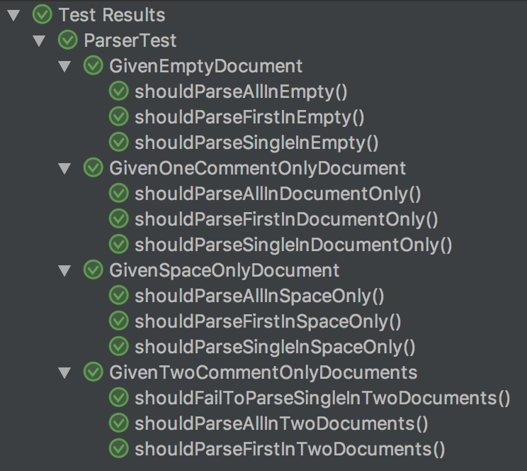
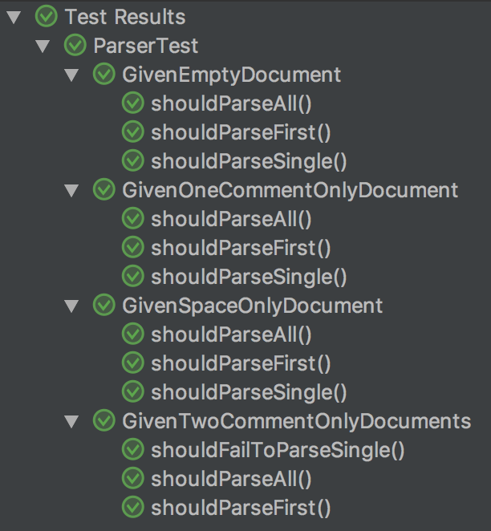

# Structured JUnit 5 Testing

Automated tests are critical to any reasonable software project.
Some even say that test code is more important than production code,
because it's easier to recreate the production code from the tests than the other way around.
Anyway, they are valuable assets, so it's necessary to keep them clean.

Adding new tests is something you'll be doing every day, but hold yourself from getting into a write-only mode:
Its overwhelmingly tempting to simply duplicate an existing test method and change just some details for the new test.
But when you refactor the production code, you often have to change some test code, too.
If this is spilled all over your tests, you will have a hard time;
and what's worse, you will be tempted to not do the refactoring or even stop writing tests.
So also in your test code you'll have to reduce code duplication to a minimum from the very beginning.
It's so little extra work to do now, when you're into the subject, that it will amortize in no time.

JUnit 5 gives us some opportunities to do this even better, and I'll show you some techniques here.

Any examples I can come up with are necessarily simplified, as they can't have the full complexity of a real system.
So bear with me while I try to contrive examples with enough complexity to show the effects;
and allow me to challenge your fantasy that some things, while they are just over engineered at this scale,
will prove useful when things get bigger.

If you like, you can follow the refactorings done here by looking at the tests
in [this](https://github.com/t1/junit-5-structure-demo) git project.
They are numbered to match the order presented here.


## Example: Testing a Parser With Three Methods for Four Documents

Let's take a parser for a stream of documents (like in YAML) as an example. It has three methods:

```java
public class Parser {
    /**
     * Parse the one and only document in the input.
     * 
     * @throws ParseException if there is none or more than one.
     */
    public static Document parseSingle(String input);

    /**
    * Parse only the first document in the input.
     * 
     * @throws ParseException if there is none.
     */
    public static Document parseFirst(String input);

    /** Parse the list of documents in the input; may be empty, too. */
    public static Stream parseAll(String input);
}
```

We write tests for four input files (not to make things too complex):
One is empty,
one contains a document with only one space character,
one contains a single document containing only a comment,
and one contains two documents with each only containing a comment.
That makes a total of 12 tests looking similar to this one:

```java
class ParserTest {
    @Test void shouldParseSingleInDocumentOnly() {
        String input = "# test comment";

        Document document = Parser.parseSingle(input);

        assertThat(document).isEqualTo(new Document().comment(new Comment().text("test comment")));
    }
}
```

Following the BDD `given-when-then` schema I first have a test setup part (given),
then an invocation of the system under test (when),
and finally a verification of the outcome (then).
These three parts are delimited with empty lines.
For the verification I use [AssertJ](https://joel-costigliola.github.io/assertj/index.html).

To reduce duplication, we extract the `given` and `when` parts into methods:

```java
class ParserTest {
    @Test void shouldParseSingleInDocumentOnly() {
        String input = givenCommentOnlyDocument();

        Document document = whenParseSingle(input);

        assertThat(document).isEqualTo(COMMENT_ONLY_DOCUMENT);
    }
}
```

Or when the parser is expected to fail:

```java
class ParserTest {
    @Test void shouldParseSingleInEmpty() {
        String input = givenEmptyDocument();

        ParseException thrown = whenParseSingleThrows(input);

        assertThat(thrown).hasMessage("expected exactly one document, but found 0");
    }
}
```

The `given...` methods are called three times each, once for every parser method.
The `when...` methods are called four times each, once for every input document,
minus the cases where the tests expect exceptions.
There is actually not so much reuse for the `then...` methods;
we only extract some constants for the expected documents here, e.g. `COMMENT_ONLY`.

But reuse is not the most important reason to extract a method.
It's more about hiding complexity and staying at a single level of abstraction.
As always, you'll have to find the right balance:
Is `whenParseSingle(input)` better than `Parser.parseSingle(input)`?
It's so simple and unlikely that you will ever have to change it by hand, that it's probably better to *not* extract it.
If you want to go into more detail, read the Clean Code book by Robert C. Martin, it's worth it!

As stated in the introduction, we extract these methods here only to prepare for the next step.

You can see that the `given...` methods all return an `input` String, while all `when...` methods take that string as an argument.
When tests get more complex, they produce or require more than one object, so you'll have to pass them via field.
But normally I wouldn't do this in such a simple case.
Let's do that here anyway, again as a preparation for the next step:

```java
class ParserTest {
    private String input;

    @Test void shouldParseAllInEmptyDocument() {
        givenEmptyDocument();

        Stream stream = whenParseAll();

        assertThat(stream.documents()).isEmpty();
    }

    private void givenEmptyDocument() {
        input = "";
    }

    private Stream whenParseAll() {
        return Parser.parseAll(input);
    }
}
```


## Adding Structure

It would be nice to group all tests with the same input together, so it's easier to find them in a larger test base,
and to more easily see if there are some setups missing or duplicated.
To do so in JUnit 5, you can surround all tests that call, e.g., `givenTwoCommentOnlyDocuments()` with an inner class `GivenTwoCommentOnlyDocuments`.
To have JUnit still recognize the nested test methods, we'll have to add a `@Nested` annotation:

```java
class ParserTest {
    @Nested class GivenOneCommentOnlyDocument {
        @Test void shouldParseAllInDocumentOnly() {
            givenOneCommentOnlyDocument();

            Stream stream = whenParseAll();

            assertThat(stream.documents()).containsExactly(COMMENT_ONLY);
        }
    }
}
```

In contrast to having separate top-level test classes, JUnit runs these tests as nested groups, so we see the test run structured like this:



Nice, but we can go a step further.
Instead of calling the respective `given...` method from each test method, we can call it in a `@BeforeEach` setup method,
and as there is now only one call for each `given...` method, we can inline it:

```java
@Nested class GivenTwoCommentOnlyDocuments {
    @BeforeEach void givenTwoCommentOnlyDocuments() {
        input = "# test comment\n---\n# test comment 2";
    }
}
```

We could have a little bit less code (which is generally a good thing) by using a constructor like this:

```java
@Nested class GivenTwoCommentOnlyDocuments {
    GivenTwoCommentOnlyDocuments() {
        input = "# test comment\n---\n# test comment 2";
    }
}
```

...or even an anonymous initializer like this:

```java
@Nested class GivenTwoCommentOnlyDocuments {
    {
        input = "# test comment\n---\n# test comment 2";
    }
}
```

But I prefer methods to have names that say what they do, and as you can see in the first variant, setup methods are no exception.
I sometimes even have several `@BeforeEach` methods in a single class, when they do separate setup work.
This gives me the advantage that I don't have to read the method body to understand what it does,
and when some setup doesn't work as expected, I can start by looking directly at the method that is responsible for that.

Now the test method names still describe the setup they run in, i.e. the `InDocumentOnly` part in `shouldParseSingleInDocumentOnly`.
In the code structure as well as in the output provided by the JUnit runner, this is redundant, so we should remove it: `shouldParseSingle`.
The JUnit runner now looks like this:



Most real world tests share only part of the setup with other tests.
You can extract the common setup and simply add the specific setup in each test.
I often use objects with all fields set up with reasonable dummy values, and only modify those relevant for each test,
e.g. setting one field to `null` to test the outcome.
Just make sure to express that additional setup step in the name of the test, or you may overlook it.

When things get more complex, it's probably better to nest several layers of `Given...` classes,
even when they have only one test, just to make all setup steps visible in one place, the class names,
and not some in the class names and some in the method names.


## Extracting `when...`

You may have noticed that the four classes not only all have the same three test method names (except for the tests that catch exceptions),
these three also call exactly the same `when...` methods; they only differ in the checks performed.
This is, too, code duplication that has a potential to become harmful when the test code base gets big.
In this carefully crafted example, we have a very symmetric set of three `when...` methods we want to call;
this not always the case, so it's not something you'll be doing with every test class.
But it's good to know the technique, just in case. Let's have a look at how it works.

We can extract an abstract class `WhenParseAllFirstAndSingle` to contain the three test methods,
that delegate the actual verification to abstract `verify...` methods.
As the `when...` methods are not reused any more and the test methods have the same level of abstraction, we can also inline these.

```java
abstract class WhenParseAllFirstAndSingle {
    @Test void whenParseAll() {
        Stream stream = Parser.parseAll(input);

        verifyParseAll(stream);
    }

    protected abstract void verifyParseAll(Stream stream);
}
```

The verification is done in the implementations, so we can't say something like `thenIsEmpty`, we'll need a generic name.
`thenParseAll` would be misleading, so `verify` with the method called is a good name, e.g. `verifyParseAll`.

This extraction works fine for `parseAll`, as the call never fails,
but, e.g., `parseSingle` throws an exception when there is more than one document.
So the `whenParseSingle` test has to delegate the exception for verification, too.

Let's introduce a second `verifyParseSingleException` method for that check.
When we expect an exception, we don't want to implement the `verifyParseSingle` method any more,
and when we don't expect an exception, we don't want to implement the `verifyParseSingleException`,
so we give both `verify...` methods a default implementation instead:

```java
abstract class WhenParseAllFirstAndSingle {
    @Test void whenParseSingle() {
        ParseException thrown = catchThrowableOfType(() -> {
            Document document = Parser.parseSingle(input);

            verifyParseSingle(document);
        }, ParseException.class);

        if (thrown != null)
            verifyParseSingleException(thrown);
    }

    protected void verifyParseSingle(Document document) {
        fail("expected exception was not thrown. see the verifyParseSingleParseException method for details");
    }

    protected void verifyParseSingleException(ParseException thrown) {
        fail("unexpected exception. see verifyParseSingle for what was expected", thrown);
    }
}
```

When you expect an exception, but it doesn't throw and the verification fails instead, you'll get a test failure that is not very helpful:

```
java.lang.AssertionError: Expecting code to throw <class ParseException> but threw <class java.lang.AssertionError> instead
```

So we need an even smarter `whenParseSingle`:

```java
abstract class WhenParseAllFirstAndSingle {
    @Test void whenParseSingle() {
        AtomicReference<Document> document = new AtomicReference<>();
        ParseException thrown = catchThrowableOfType(() -> document.set(Parser.parseSingle(input)), ParseException.class);

        if (thrown != null)
            verifyParseSingleException(thrown);
        else
            verifyParseSingle(document.get());
    }
}
```

We have to pass the document from the closure back to the method level.
I can't use a simple variable, as it has to be assigned to `null` as a default, making it not-effectively-final,
so the compiler won't allow me to, but I use an `AtomicReference`.

In this way, even when a test that expects a result throws an exception or vice versa, the error message is nice and helpful,
e.g. when `GivenEmptyDocument.whenParseSingle`, which throws an exception, would expect an empty document, the exception would be (stacktraces omitted):

```
AssertionError: unexpected exception. see verifyParseSingle for what was expected
Caused by: ParseException: expected exactly one document, but found 0
```

All of this does add quite some complexity to the `when...` methods, bloating them from 2 lines to 6 with a non-trivial flow.
Gladly, we can extract that to a generic `whenVerify` method that we can put into a test utilities class or even module.

```java
abstract class WhenParseAllFirstAndSingle {
    @Test void whenParseSingle() {
        whenVerify(() -> Parser.parseSingle(input), ParseException.class, this::verifyParseSingle, this::verifyParseSingleException);
    }

    protected void verifyParseSingle(Document document) {
        fail("expected exception was not thrown. see the verifyParseSingleException method for details");
    }

    protected void verifyParseSingleException(ParseException thrown) {
        fail("unexpected exception. see verifyParseSingle for what was expected", thrown);
    }

    /**
     * Calls the <code>call</code> and verifies the outcome.
     * If it succeeds, it calls <code>verify</code>.
     * If it fails with an exception of type <code>exceptionClass</code>, it calls <code>verifyException</code>.
     * 
     * @param call The `when` part to invoke on the system under test
     * @param exceptionClass The type of exception that may be expected
     * @param verify The `then` part to check a successful outcome
     * @param verifyException The `then` part to check an expected exception
     * @param <T> The type of the result of the `call`
     * @param <E> The type of the expected exception
     */
    public static <T, E extends Throwable> void whenVerify(Supplier<T> call, Class<E> exceptionClass, Consumer<T> verify, Consumer<E> verifyException) {
        AtomicReference<T> success = new AtomicReference<>();
        E failure = catchThrowableOfType(() -> success.set(call.get()), exceptionClass);

        if (failure != null)
            verifyException.accept(failure);
        else
            verify.accept(success.get());
    }
}
```

The call to `whenVerify` is still not easy to understand;
I've added extensive JavaDoc to help the reader, but it still requires getting into.
We can make the call more expressive by using a fluent builder, so it looks like this:

```java
abstract class WhenParseAllFirstAndSingle {
    @Test void whenParseFirst() {
        when(() -> Parser.parseFirst(input))
            .failsWith(ParseException.class).then(this::verifyParseFirstException)
            .succeeds().then(this::verifyParseFirst);
    }
}
```

This bloats the implementation, but the call is okay now.

The tests themselves already look nice, and that's the most important part:

```java
@Nested class GivenTwoCommentOnlyDocuments extends WhenParseAllFirstAndSingle {
    @BeforeEach void givenTwoCommentOnlyDocuments() {
        input = "# test comment\n---\n# test comment 2";
    }

    @Override protected void verifyParseAll(Stream stream) {
        assertThat(stream.documents()).containsExactly(COMMENT_ONLY, COMMENT_ONLY_2);
    }

    @Override protected void verifyParseFirst(Document document) {
        assertThat(document).isEqualTo(COMMENT_ONLY);
    }

    @Override protected void verifyParseSingleException(ParseException thrown) {
        assertThat(thrown).hasMessage("expected exactly one document, but found 2");
    }
}
```

## Multiple `When...` Classes

If you have tests that only apply to a specific test setup, you can simply add them directly to that `Given...` class.
If you have tests that apply to all test setups, you can add them to the `When...` super class.
But there may be tests that apply to more than one setup, but not to all;
you may want to have more than one `When...` superclass, which isn't allowed in Java.
But you can change the `When...` class(es) to interfaces with default methods.
You'll then have to change the fields used to pass test setup objects (the `input` String in this case) to be static,
as interfaces can't access non-static fields.
This looks like a simple change, but it can cause nasty bugs: You'll have to set these fields for every test,
or you may accidentally inherit them from tests that ran before, i.e. your tests depend on the execution order.
This will bend the time-space-continuum when you try to debug it.
So be extra careful, here.
It's probably worth resetting everything to `null` in a top level `@BeforeEach`:

```java
class ParserTest {
    private static String input;

    @BeforeEach void setup() {
        input = null;
    }
}
```

Note that `@BeforeEach` methods from super classes are executed before those in sub classes.

Otherwise, the change is straight forward:

```java
class ParserTest {
    private static String input;

    interface WhenParseAllFirstAndSingle {
        @Test default void whenParseAll() {
            Stream stream = Parser.parseAll(input);

            verifyParseAll(stream);
        }

        void verifyParseAll(Stream stream);
    }

    @Nested class GivenTwoCommentOnlyDocuments implements WhenParseAllFirstAndSingle {
        // ...
    }
}
```

## Generic Verifications

You may want to add generic verifications,
e.g., YAML documents and streams should render `toString` equal to the input they where generated from.
For the `whenParseAll` method, we can add a verification line directly after the call to `verifyParseAll`:

```
assertThat(document).hasToString(input);
```

This is not so easy with the tests that are sometimes expected to fail (e.g. `whenParseSingle`).
We chose an implementation using the `whenVerify` method which we wanted to be generic.
We could give up on that and inline it, but that would be sad.
Alternatively we could add the verification to all overridden `verifyParseFirst` methods.
The drawback is that this would add duplication and it'd be easy to forget.
What's worse, each new verification we wanted to add, we'd have to add to every `verify...` method;
this just doesn't scale.

It's better to call the generic verification directly after the abstract verification:

```java
class ParserTest {
    interface WhenParseAllFirstAndSingle {
        @Test default void whenParseFirst() {
            when(() -> Parser.parseFirst(input))
                .failsWith(ParseException.class).then(this::verifyParseFirstException)
                .succeeds().then(document ->
            {
                verifyToStringEqualsInput(document);
                verifyParseFirst(document);
            });
        }

        default void verifyParseFirst(Document document) {
            fail("expected exception was not thrown. see the verifyParseFirstException method for details");
        }

        default void verifyParseFirstException(ParseException thrown) {
            fail("unexpected exception. see verifyParseFirst for what was expected", thrown);
        }

        default void verifyToStringEqualsInput(Document document) {
            assertThat(document).hasToString(input);
        }
    }
}
```

If you have more than one generic verification, it would be better to extract them to a `verifyParseFirstGeneric` method.

There is one last little nasty detail hiding in this test example:
The `verifyToStringEqualsInput(Document document)` method has to be overridden in `GivenTwoCommentOnlyDocuments`,
as only the first document from the stream is part of the `toString`, not the complete `input`.
Make sure to explain such things with a comment.


## tl;dr

To add structure to a long sequence of test methods in a class,
group them according to their test setup in inner classes annotated as `@Nested`.
Name these classes `Given...` and set them up in one or more `@BeforeEach` methods.
Pass the objects that are set up and then used in your `when...` method in fields.

When there are sets of tests that should be executed in several setups (and given you prefer complexity over duplication),
you may want to extract them to a super class,
or (if you need more than one such set in one setup) to an interface with default methods (and make the fields you set up static).
Name these classes or interfaces `When...` and delegate the verification to methods called `verify...`.

I think grouping test setups is something you should do even in medium sized test classes; it pays off quickly.
Extracting sets of tests adds quite some complexity,
so you probably should do it only when you have a significantly large set of tests to share between test setups, maybe 7.

I hope this helps you to reap the benefits JUnit 5 provides.
I'd be glad to hear it, when you have any feedback, probably best as an issue on GitHub.
