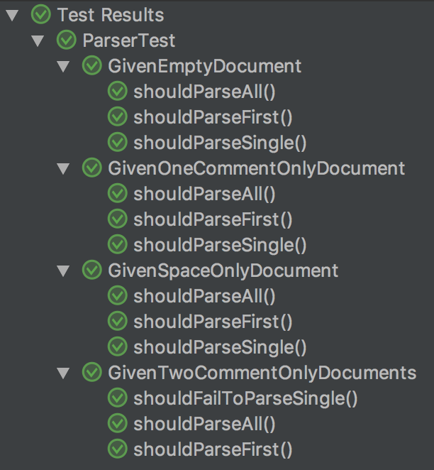
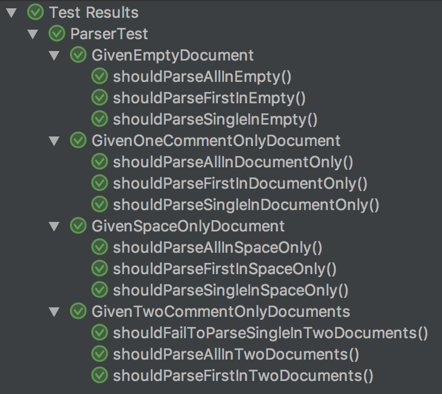

# Header

bli

link to [this](https://github.com/t1/junit-5-structure-demo) project

## Subtitle

blah

```java
public class Parser {
    /**
     * Parse the one and only document in the input.
     *
     * @throws ParseException if there is none or more than one.
     */
    public static Document parseSingle(String input);

    /**
     * Parse only the first document in the input.
     *
     * @throws ParseException if there is none.
     */
    public static Document parseFirst(String input);

    /** Parse the list of documents in the input; may be empty, too. */
    public static Stream parseAll(String input);
}
```

blub

some `code` and `tt` parts




